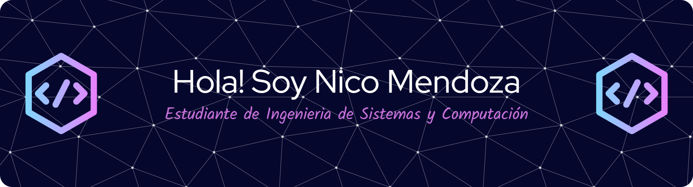

# ¡Hola! 👋 Soy Nico Mendoza

Soy un **Ingeniero de Sistemas en formación** con una profunda pasión por las **redes de comunicación** y las **bases de datos**. Mi objetivo es diseñar y administrar infraestructuras tecnológicas eficientes y seguras que impulsen la transformación digital y comunicacion en las organizaciones.

## Sobre mí

- **Nombre:** Andrew Nicolay Prieto Mendoza
- **Ubicación:** Bogotá, Colombia
- **Profesión:** Ingeniero de Sistemas y Computación (en formación)
- **Intereses:** Redes de comunicación, administración de bases de datos, seguridad informática

## Proyectos

| Proyecto             | Descripción breve                                      | Enlace                                     |
|----------------------|--------------------------------------------------------|--------------------------------------------|
| **Sistema CRUD para inscripción de materias con SQLite**       | Sistema CRUD para gestionar la inscripción de materias de estudiantes, conectado a una base de datos SQLite. Permite crear, leer, actualizar y eliminar inscripciones de forma sencilla y eficiente.              | [Repositorio](https://github.com/gecrodriguezpe/ProyectoFinalPOO) |
| **Estructura de datos multiverso**       | Proyecto de estructuras de datos que combina listas circulares y árboles AVL para crear una estructura tipo “multiverso”. Las listas circulares contienen raíces de árboles AVL, cuyas ramas apuntan nuevamente a las raíces, formando una estructura interconectada y eficiente.                  | [Repositorio](https://github.com/Anthonyrs4/Proyecto-DS) |
| **Proyecto planeacion de rutas**       | Sistema para gestionar rutas entre ciudades que permite agregar ciudades y calcular la ruta más corta pasando por ciudades seleccionadas. Ideal para optimizar viajes y planificar itinerarios.          | [Repositorio](https://github.com/THOMASunal/Multiverso) |

## 🛠️ Tecnologías y Herramientas

## 📊 Estadísticas de GitHub

## 📬 Contáctame

